# Week 1 — Cyber Security TecArt

> Dokumentasi penyelesaian challenge Week 1 pada kegiatan Cyber Security TecArt.

---

# Identitas

**Nama:** Dewa Ayu Viozha Liandini  
**NIM:** 260530911032  
**Divisi:** Cyber Security  
**Week:** Week 1  
**Kategori:** General Skills  

---

# Tentang Week 1

Pada Week 1, saya mengerjakan beberapa challenge pada kategori **General Skills**. Challenge yang diberikan memiliki bentuk dan teknik penyelesaian yang berbeda-beda, mulai dari mencari informasi tersembunyi di dalam file, menganalisis log, menjalankan binary, melakukan operasi bilangan biner dan hexadecimal, decoding beberapa jenis encoding, hingga menggunakan koneksi jaringan melalui Netcat dan SSH.

Dalam proses pengerjaan, saya menggunakan **Ubuntu/WSL** sebagai lingkungan kerja utama. Setiap challenge saya kerjakan dengan menganalisis informasi yang diberikan terlebih dahulu, kemudian menentukan command atau teknik yang sesuai untuk memperoleh flag.

Challenge yang berhasil diselesaikan pada Week 1 adalah:

1. Strings It
2. Log Hunt
3. Running Binary
4. Binhexa
5. Multi Code
6. Nice Netcat
7. Super SSH
8. Piece by Piece

---

# Tools yang Digunakan

Beberapa tools dan command yang digunakan selama pengerjaan Week 1 antara lain:

- Ubuntu / WSL
- Terminal Linux
- `strings`
- `grep`
- `head`
- `cat`
- `chmod`
- `nc` / Netcat
- `ssh`
- `xxd`
- `unzip`
- Python
- Bash
- Operasi Binary
- Operasi Hexadecimal
- Base64 decoding
- URL decoding
- ROT13

---

# 1. Strings It

## Informasi Challenge

- **Nama:** Strings It
- **Kategori:** General Skills
- **Difficulty:** Easy
- **Platform:** picoCTF
- **Tools:** `strings`, `grep`

## Analisis

Pada challenge **Strings It**, saya diberikan sebuah file yang perlu diperiksa untuk menemukan informasi yang tersembunyi di dalamnya.

Dari nama challenge, saya memahami bahwa informasi yang dicari kemungkinan berupa teks atau string yang tersimpan di dalam file tersebut. Oleh karena itu, saya mencoba menggunakan command `strings` yang dapat digunakan untuk menampilkan rangkaian karakter yang dapat dibaca dari sebuah file.

Tujuan saya adalah menemukan teks yang berhubungan dengan flag tanpa harus membaca seluruh isi file secara manual.

## Proses Penyelesaian

Pertama, saya menjalankan command:

```bash
strings strings
```

Command tersebut digunakan untuk menampilkan string yang dapat dibaca dari file `strings`.

Karena hasil yang ditampilkan cukup banyak, saya kemudian menggunakan `grep` untuk mencari teks yang memiliki kemungkinan berhubungan dengan flag.

```bash
strings strings | grep -i CTF
```

Saya juga mencoba pencarian menggunakan beberapa pola yang umum ditemukan pada flag:

```bash
strings strings | grep -E 'pico|flag|\{|\}'
```

Dari hasil pencarian tersebut, saya menemukan string yang berbentuk flag:

`academy{5tRIng5_1T_DAEbE8bd}`

Dengan demikian, flag berhasil ditemukan.

## Command yang Digunakan

```bash
strings strings
strings strings | grep -i CTF
strings strings | grep -E 'pico|flag|\{|\}'
```

## Fungsi Command

- `strings` digunakan untuk mengambil dan menampilkan karakter yang dapat dibaca dari sebuah file.
- `grep` digunakan untuk mencari pola atau teks tertentu dari hasil command.
- `-i` membuat pencarian tidak membedakan huruf besar dan kecil.
- `-E` memungkinkan penggunaan pola regular expression.

## 🚩 Flag

`academy{5tRIng5_1T_DAEbE8bd}`

## Dokumentasi

**Screenshot 1 — Tampilan Challenge**

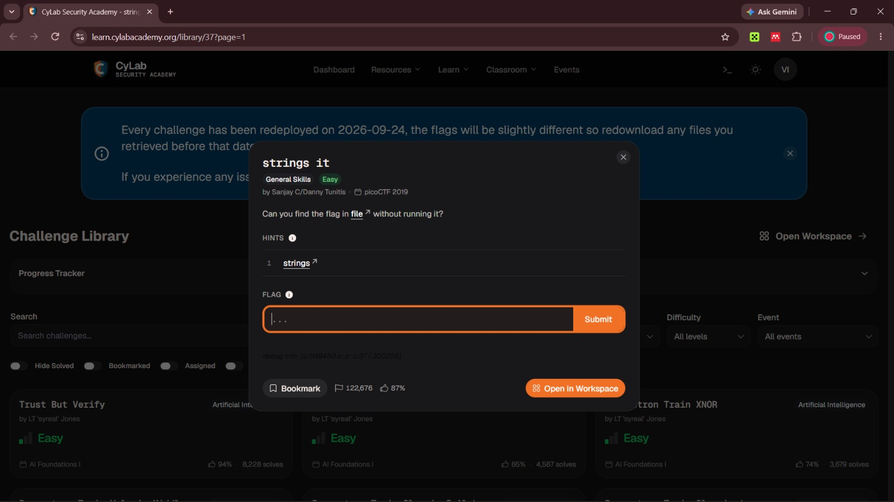

**Screenshot 2 — Proses Pengerjaan**

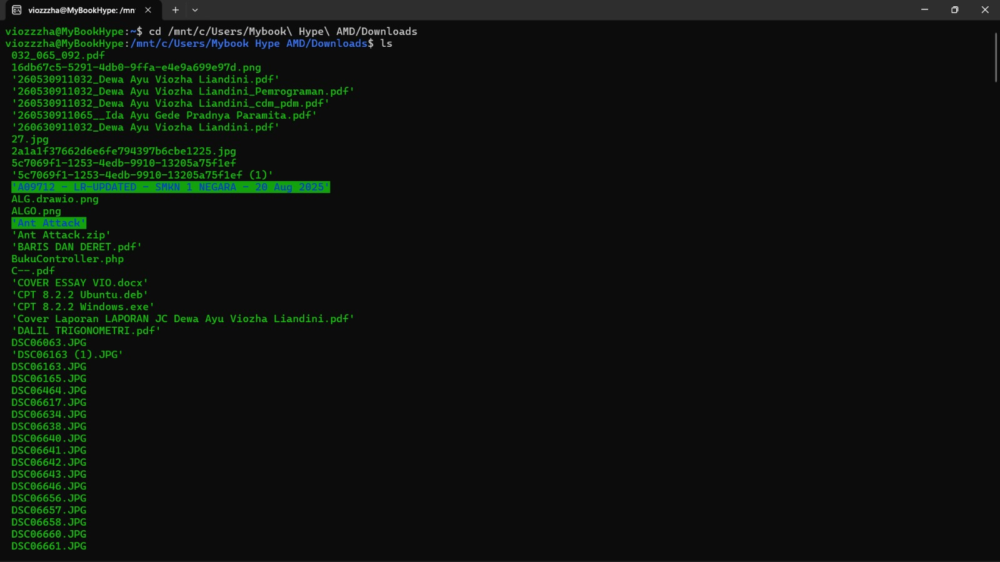

**Screenshot 3 — Proses Pencarian Flag**

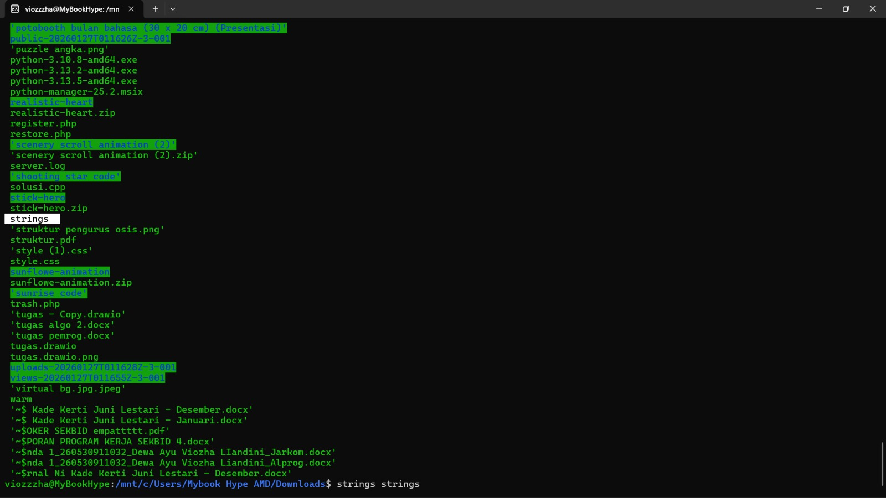

**Screenshot 4 — Menemukan Flag**

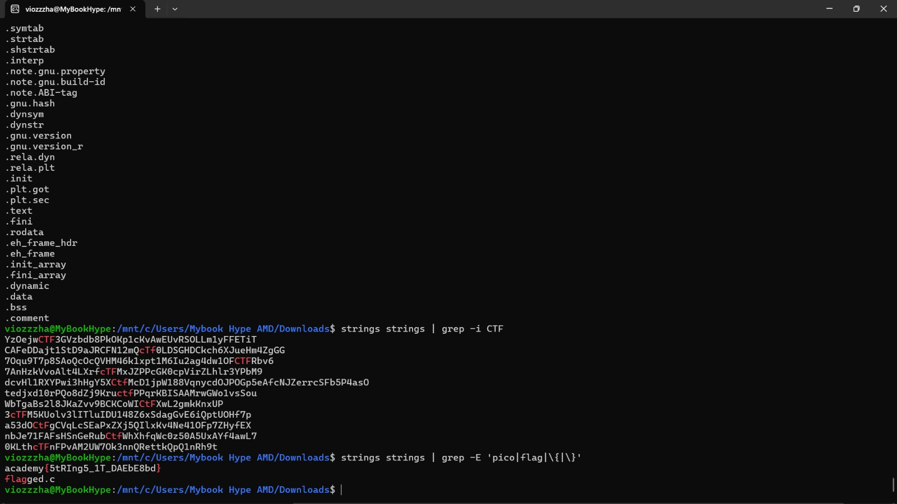

**Screenshot 5 — Hasil**

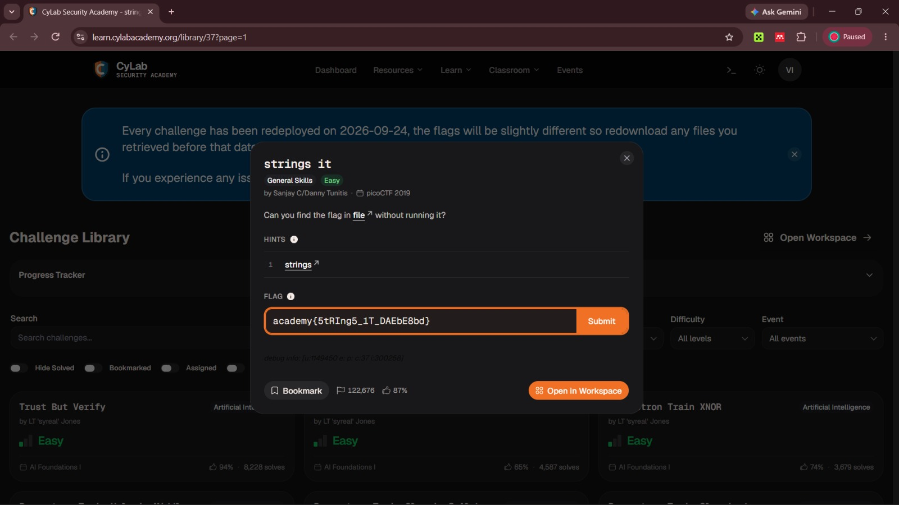

**Screenshot 6 — Submission / Correct**

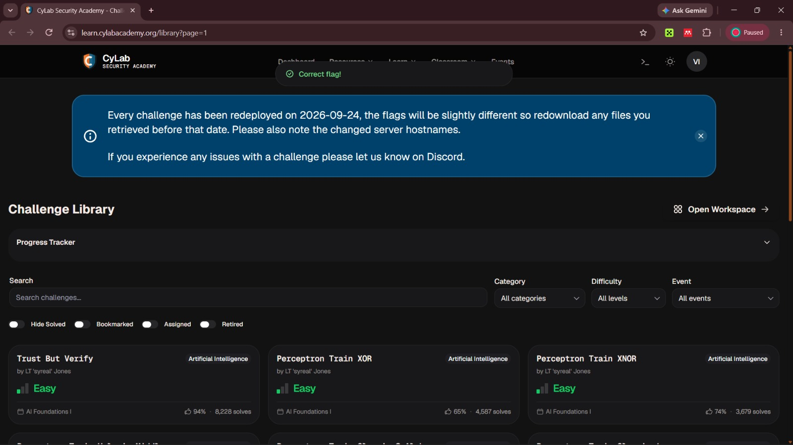

---

# 2. Log Hunt

## Informasi Challenge

- **Nama:** Log Hunt
- **Kategori:** General Skills
- **Tools:** `head`, `grep`
- **Environment:** Ubuntu / WSL

## Analisis

Pada challenge **Log Hunt**, saya diberikan sebuah file log bernama `server.log`.

File log biasanya dapat berisi banyak informasi dari aktivitas suatu sistem. Karena jumlah data di dalam log dapat cukup banyak, saya perlu mencari bagian yang relevan daripada membaca seluruh isi file satu per satu.

Dari challenge ini saya memahami bahwa flag kemungkinan disimpan sebagai beberapa bagian yang terdapat di dalam file log. Oleh karena itu, saya menggunakan command untuk melihat isi awal file dan kemudian melakukan pencarian berdasarkan kata tertentu.

## Proses Penyelesaian

Pertama, saya melihat beberapa baris awal dari file menggunakan:

```bash
head -30 "/mnt/c/Users/Mybook Hype AMD/Downloads/server.log"
```

Command tersebut digunakan untuk melihat 30 baris pertama dari file.

Setelah itu saya mencari bagian log yang memiliki keyword `FLAGPART`.

```bash
grep "FLAGPART" "/mnt/c/Users/Mybook Hype AMD/Downloads/server.log"
```

Dari hasil pencarian ditemukan beberapa bagian:

```text
picoCTF{us3_
y0urlinux_
sk1lls_
cedfa5fb}
```

Bagian-bagian tersebut kemudian disusun sesuai urutannya sehingga membentuk flag lengkap:

`picoCTF{us3_y0urlinux_sk1lls_cedfa5fb}`

## Command yang Digunakan

```bash
head -30 "/mnt/c/Users/Mybook Hype AMD/Downloads/server.log"
grep "FLAGPART" "/mnt/c/Users/Mybook Hype AMD/Downloads/server.log"
```

## Fungsi Command

- `head -30` digunakan untuk menampilkan 30 baris pertama dari sebuah file.
- `grep` digunakan untuk mencari baris yang mengandung teks tertentu.
- Keyword `FLAGPART` digunakan untuk menemukan bagian-bagian flag.

## 🚩 Flag

`picoCTF{us3_y0urlinux_sk1lls_cedfa5fb}`

## Dokumentasi

**Screenshot 1 — Tampilan Challenge**

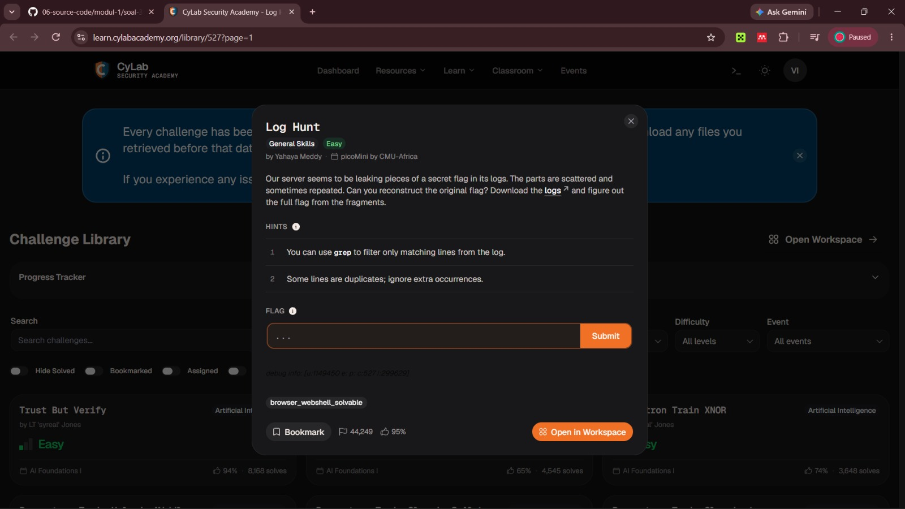

**Screenshot 2 — Mencari FLAGPART**

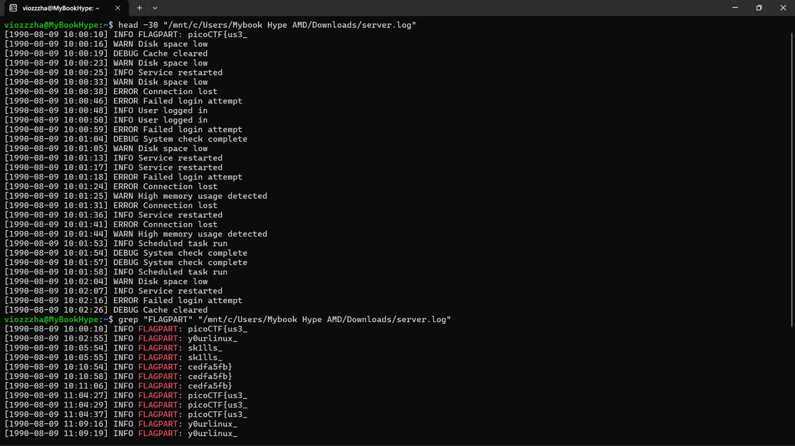

**Screenshot 3 — Hasil Pencarian**

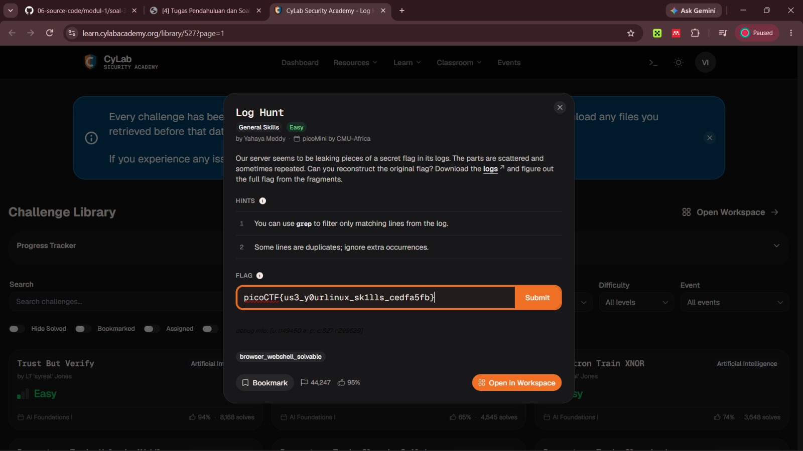

**Screenshot 4 — Submission / Correct**

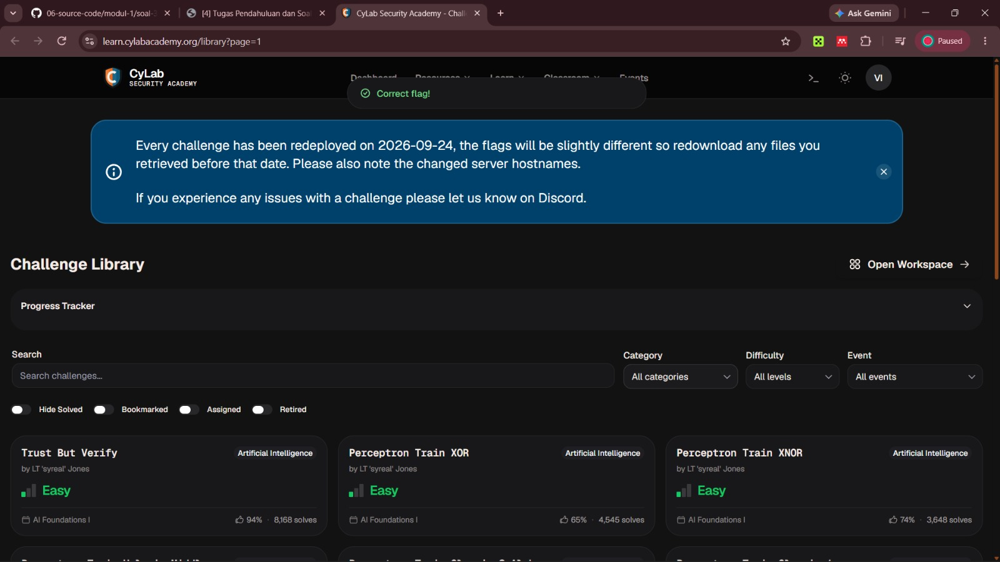

---

# 3. Running Binary

## Informasi Challenge

- **Nama:** Running Binary
- **Kategori:** General Skills
- **Environment:** Ubuntu / WSL
- **Tools:** `chmod`, binary executable

## Analisis

Pada challenge **Running Binary**, saya diberikan sebuah file binary bernama `warm`.

File tersebut perlu dijalankan untuk mengetahui output yang diberikan oleh program. Namun sebelum dijalankan, file harus memiliki permission untuk dieksekusi.

Karena file belum dapat langsung dijalankan, saya perlu memberikan permission execute terlebih dahulu.

## Proses Penyelesaian

Pertama, saya memberikan permission execute pada file menggunakan:

```bash
chmod +x warm
```

Setelah permission berhasil diberikan, saya menjalankan binary menggunakan:

```bash
./warm -h
```

Option `-h` digunakan pada program tersebut dan program memberikan informasi berupa flag.

Output yang diperoleh adalah:

```text
Oh, help? I actually don't do much, but I do have this flag here:
picoCTF{b1scu1ts_4nd_gr4vy_ac5832c}
```

Dengan demikian, flag berhasil diperoleh.

## Command yang Digunakan

```bash
chmod +x warm
./warm -h
```

## Fungsi Command

- `chmod +x` digunakan untuk memberikan permission execute pada file.
- `./warm` digunakan untuk menjalankan binary dari current directory.
- `-h` merupakan argument yang diberikan kepada program.

## 🚩 Flag

`picoCTF{b1scu1ts_4nd_gr4vy_ac5832c}`

## Dokumentasi

**Screenshot 1 — Tampilan Challenge**

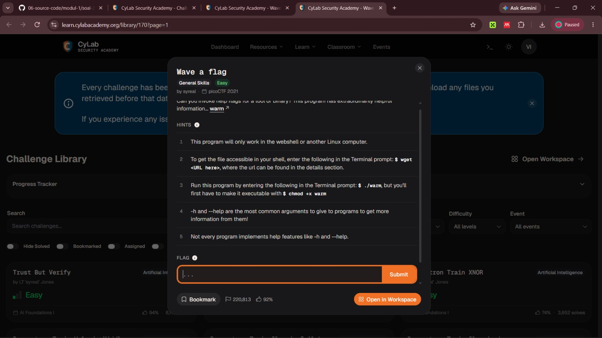

**Screenshot 2 — File / Environment**

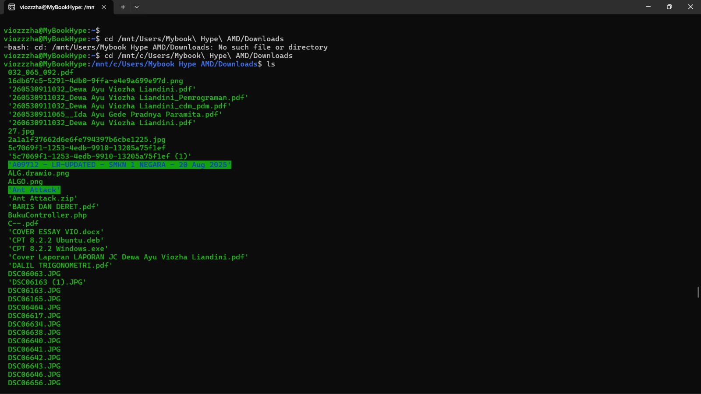

**Screenshot 3 — Menjalankan Binary**

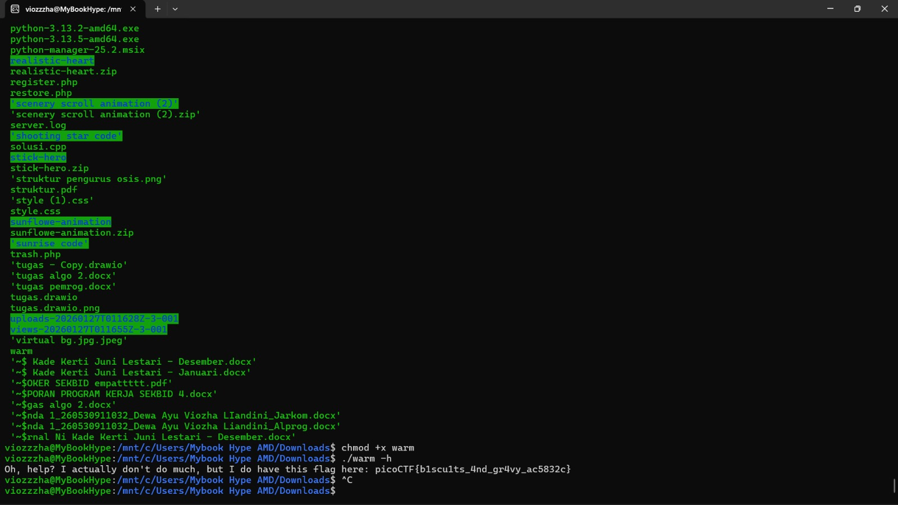

**Screenshot 4 — Hasil**

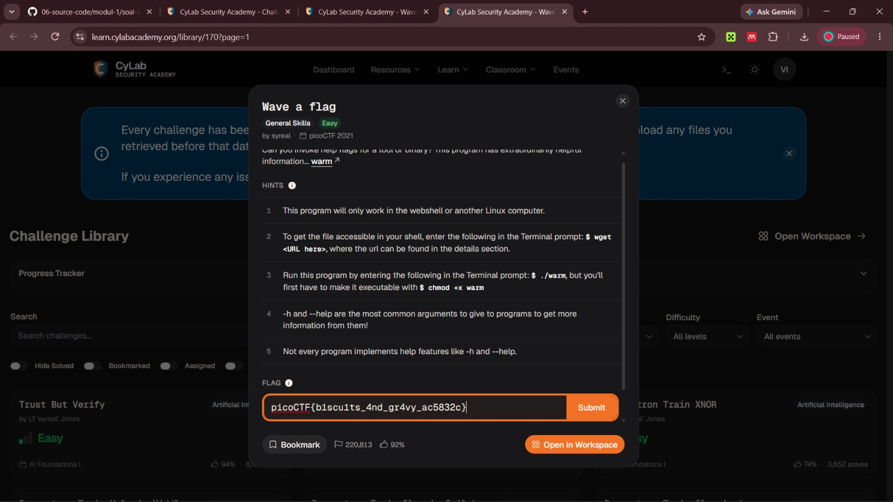

**Screenshot 5 — Correct / Submission**

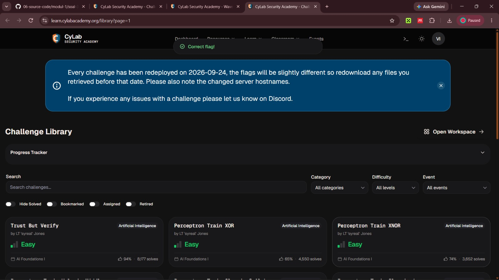

---

# 4. Binhexa

## Informasi Challenge

- **Nama:** Binhexa
- **Kategori:** General Skills
- **Topik:** Binary dan Hexadecimal
- **Tools:** Ubuntu Terminal

## Analisis

Pada challenge **Binhexa**, saya diberikan beberapa operasi yang berkaitan dengan bilangan biner dan hexadecimal.

Challenge ini mengharuskan saya memahami hasil dari operasi yang diberikan sebelum memasukkan jawaban ke program. Beberapa operasi yang digunakan antara lain operasi bitwise dan operasi aritmatika.

Operasi yang muncul dalam challenge antara lain:

- `&`
- `<<`
- `|`
- `+`
- `*`

Saya menyelesaikan operasi tersebut secara bertahap sesuai urutan yang diberikan oleh challenge.

## Proses Penyelesaian

Pada setiap tahap, challenge memberikan operasi yang harus diselesaikan. Saya mengikuti setiap operasi dan menggunakan hasil dari operasi sebelumnya untuk melanjutkan ke tahap berikutnya.

Beberapa jenis operasi yang digunakan adalah:

### Right Shift

Simbol:

```text
>>
```

### AND

Simbol:

```text
&
```

Operasi ini membandingkan bit pada dua bilangan.

### Left Shift

Simbol:

```text
<<
```

Operasi ini menggeser bit ke sebelah kiri.

### OR

Simbol:

```text
|
```

Operasi ini melakukan operasi OR pada bit.

Selain operasi bitwise, terdapat juga operasi `+` dan `*` yang digunakan sesuai instruksi dari challenge.

Setelah menyelesaikan seluruh tahapan, challenge meminta hasil akhir dalam bentuk hexadecimal.

Hasil yang saya masukkan adalah:

```text
B07C
```

Setelah jawaban dinyatakan benar dengan status **Correct!**, saya mendapatkan flag.

## Teknik yang Digunakan

- Binary operation
- Right Shift
- Bitwise AND
- Left shift
- Bitwise OR
- Penjumlahan
- Perkalian
- Hexadecimal conversion

## 🚩 Flag

`academy{b1tw^3se_0p3eR@tI0n_su33essFuL_31a516a2}`

## Dokumentasi

**Screenshot 1 — Tampilan Challenge**

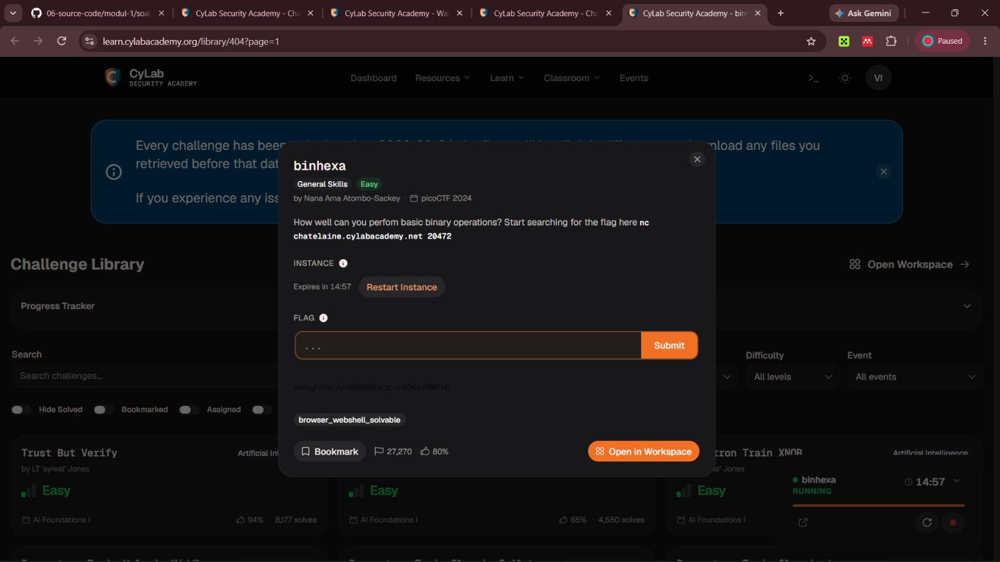

**Screenshot 2 — Proses Pengerjaan dan Perhitungan di Ubuntu**

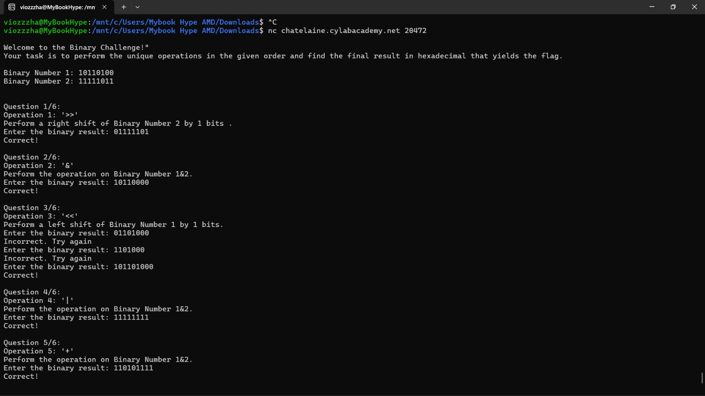

**Screenshot 3 — Lanjutan Perhitungan dan Hasil Hexadecimal di Ubuntu**

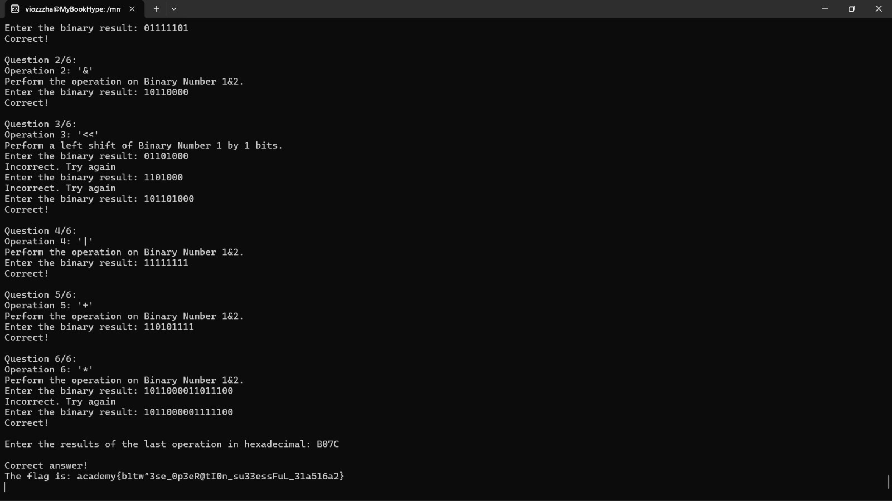

**Screenshot 4 — Hasil**

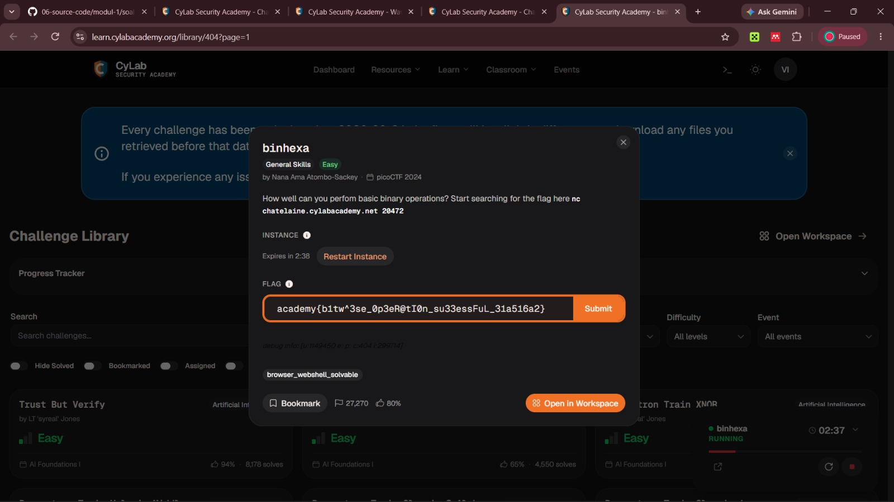

**Screenshot 5 — Correct / Submission**

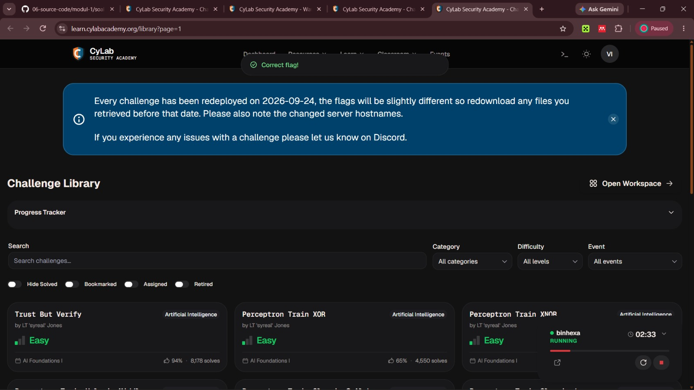

---

# 5. Multi Code

## Informasi Challenge

- **Nama:** Multi Code
- **Kategori:** General Skills
- **Topik:** Encoding dan Decoding
- **Tools:** `cat`, `xxd`, Python

## Analisis

Pada challenge **Multi Code**, data yang diberikan tidak langsung berbentuk teks yang dapat dibaca. Data tersebut melalui beberapa tahap encoding.

Dari kondisi tersebut saya memahami bahwa flag harus diperoleh dengan melakukan decoding secara bertahap. Jika hanya melakukan satu kali decoding, hasilnya belum menjadi flag sehingga proses harus dilanjutkan menggunakan metode decoding berikutnya.

## Proses Penyelesaian

Pertama saya melihat isi file:

```bash
cat message.txt
```

Setelah melihat isi file, saya mulai melakukan proses decoding sesuai format data yang diberikan.

Salah satu tahap menggunakan **Base64 decoding**.

Setelah mendapatkan data hexadecimal, saya menggunakan:

```bash
xxd -r -p
```

Command tersebut digunakan untuk mengubah hexadecimal kembali menjadi data dalam bentuk aslinya.

Pada tahap selanjutnya terdapat URL encoding dan ROT13. Saya menggunakan Python untuk membantu melakukan proses decoding tersebut.

Proses dilakukan secara bertahap sampai data terakhir menghasilkan flag:

`picoCTF{nested_enc0ding_8dd03efe}`

## Teknik yang Digunakan

- Base64 decoding
- Hexadecimal decoding
- `xxd`
- URL decoding
- ROT13
- Python
- `cat`

## 🚩 Flag

`picoCTF{nested_enc0ding_8dd03efe}`

## Dokumentasi

**Screenshot 1 — Tampilan Challenge**

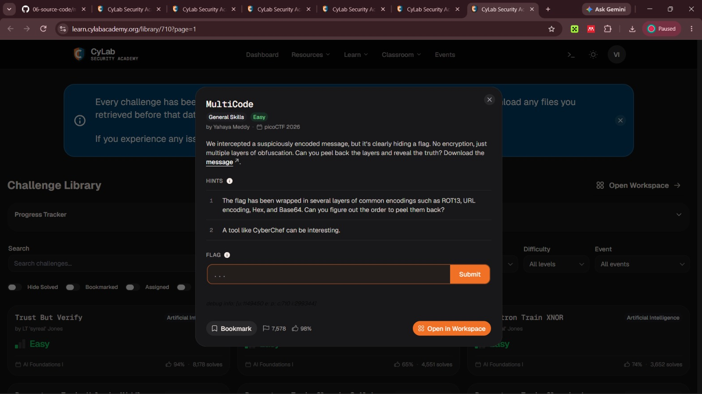

**Screenshot 2 — Data Awal dan Proses Decoding**

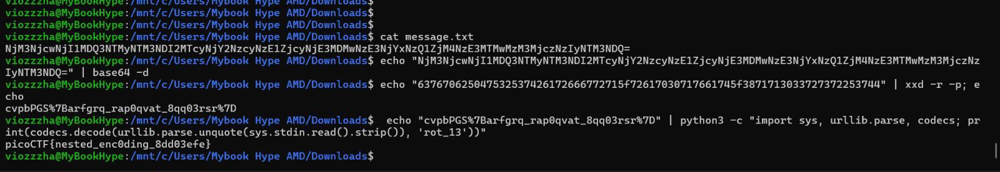

**Screenshot 3 — Hasil**

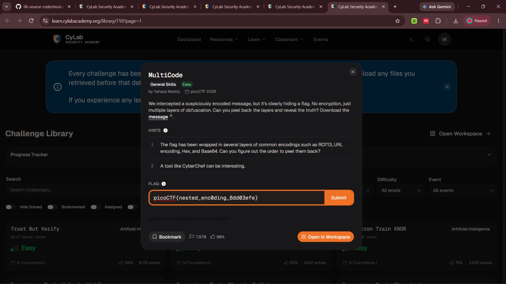

**Screenshot 4 — Submission / Correct**

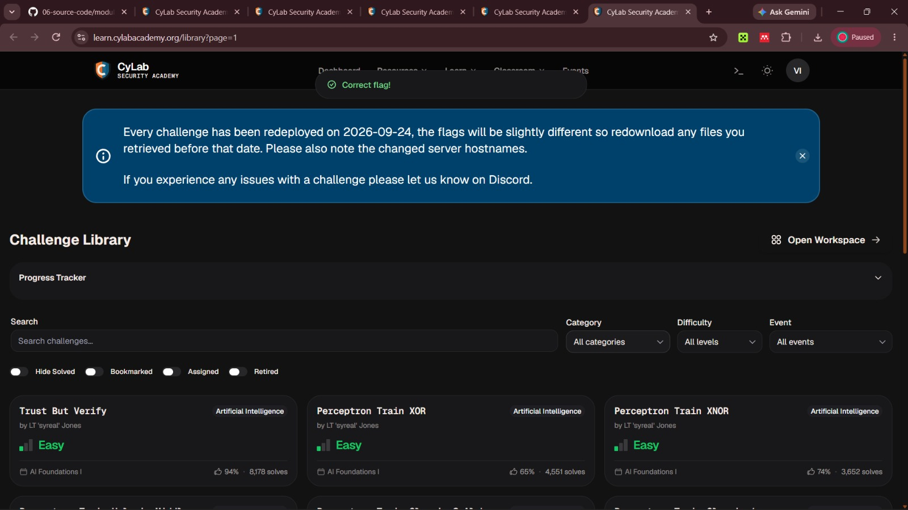

---

# 6. Nice Netcat

## Informasi Challenge

- **Nama:** Nice Netcat
- **Kategori:** General Skills
- **Tools:** Netcat, Bash
- **Server:** xebec.cylabacademy.net
- **Port:** 16606

## Analisis

Pada challenge **Nice Netcat**, saya perlu berkomunikasi dengan server menggunakan Netcat.

Setelah melakukan koneksi, server memberikan sejumlah angka. Angka tersebut bukan langsung berupa karakter yang dapat dibaca, sehingga saya perlu melakukan konversi.

Saya memahami bahwa angka tersebut dapat dikonversi menggunakan representasi ASCII sehingga hasil akhirnya dapat membentuk teks dan flag.

## Proses Penyelesaian

Pertama saya mencoba terhubung ke server menggunakan:

```bash
nc xebec.cylabacademy.net 16606
```

Setelah berhasil terhubung, server memberikan sejumlah angka.

Agar proses konversi dapat dilakukan secara otomatis, saya menggunakan command:

```bash
nc xebec.cylabacademy.net 16606 | while read n; do printf "\$(printf '%03o' "$n")"; done
```

Command tersebut membaca angka yang diberikan oleh server satu per satu dan mengubahnya menjadi karakter.

Setelah seluruh angka dikonversi, hasilnya membentuk flag:

`academy{g00d_k1tty_l1nc3_k1tty!_6d1e6}`

## Teknik yang Digunakan

- Netcat
- ASCII conversion
- Bash pipe
- `while read`
- `printf`

## Command Utama

```bash
nc xebec.cylabacademy.net 16606
```

Command otomatis:

```bash
nc xebec.cylabacademy.net 16606 | while read n; do printf "\$(printf '%03o' "$n")"; done
```

## 🚩 Flag

`academy{g00d_k1tty_l1nc3_k1tty!_6d1e6}`

## Dokumentasi

**Screenshot 1 — Tampilan Challenge**

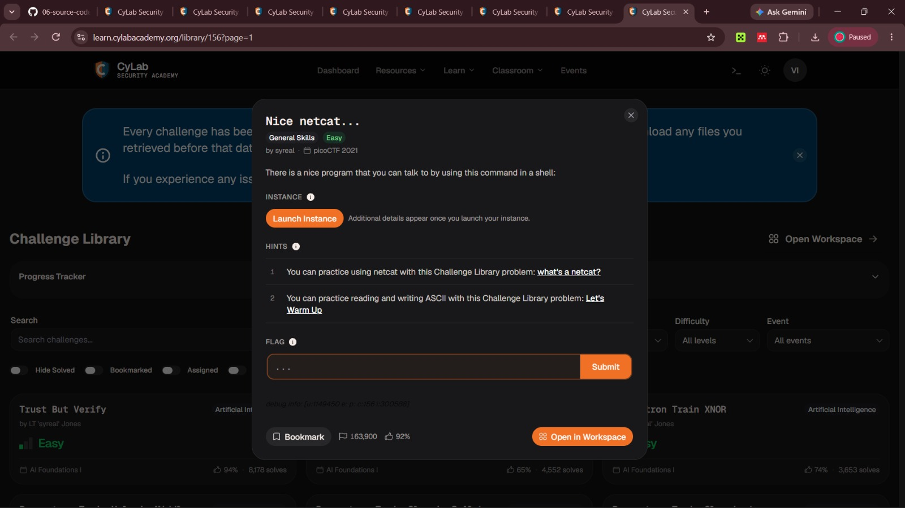

**Screenshot 2 — Proses Pencarian**

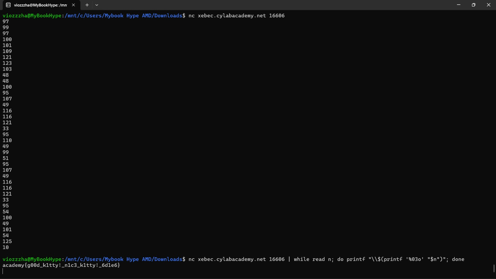

**Screenshot 3 — Hasil**

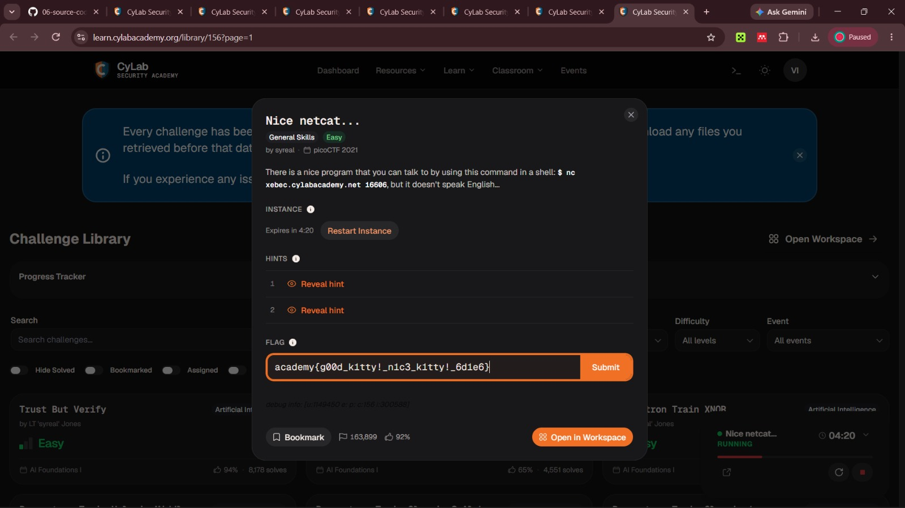

**Screenshot 4 — Correct / Submission**

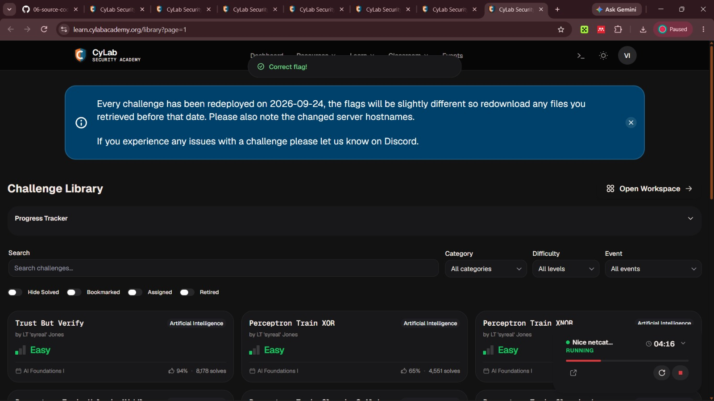

---

# 7. Super SSH

## Informasi Challenge

- **Nama:** Super SSH
- **Kategori:** General Skills
- **Protocol:** SSH
- **Username:** `ctf-player`
- **Host:** `xebec.cylabacademy.net`
- **Port:** 12035

## Analisis

Pada challenge **Super SSH**, saya diminta untuk melakukan koneksi remote ke server menggunakan protokol SSH.

SSH atau Secure Shell digunakan untuk melakukan koneksi secara aman ke komputer atau server lain melalui jaringan.

Challenge memberikan username, host, dan port yang harus digunakan untuk melakukan koneksi.

## Proses Penyelesaian

Saya melakukan koneksi menggunakan command:

```bash
ssh ctf-player@xebec.cylabacademy.net -p 12035
```

Setelah command dijalankan, sistem meminta password yang telah diberikan oleh challenge.

Setelah password dimasukkan dengan benar, saya berhasil masuk ke server sebagai user `ctf-player`.

Setelah berhasil login, server langsung menampilkan informasi flag:

```text
Welcome ctf-player, here's your flag:
academy{s3cur3_c0nn3ct10n_fbd97b2a}
```

Dengan demikian challenge berhasil diselesaikan.

## Command yang Digunakan

```bash
ssh ctf-player@xebec.cylabacademy.net -p 12035
```

## Keterangan

- `ssh` digunakan untuk melakukan koneksi Secure Shell.
- `ctf-player` merupakan username yang diberikan.
- `xebec.cylabacademy.net` merupakan hostname server.
- `-p 12035` menentukan port SSH yang digunakan oleh challenge.

## 🚩 Flag

`academy{s3cur3_c0nn3ct10n_fbd97b2a}`

## Dokumentasi

**Screenshot 1 — Tampilan Challenge**

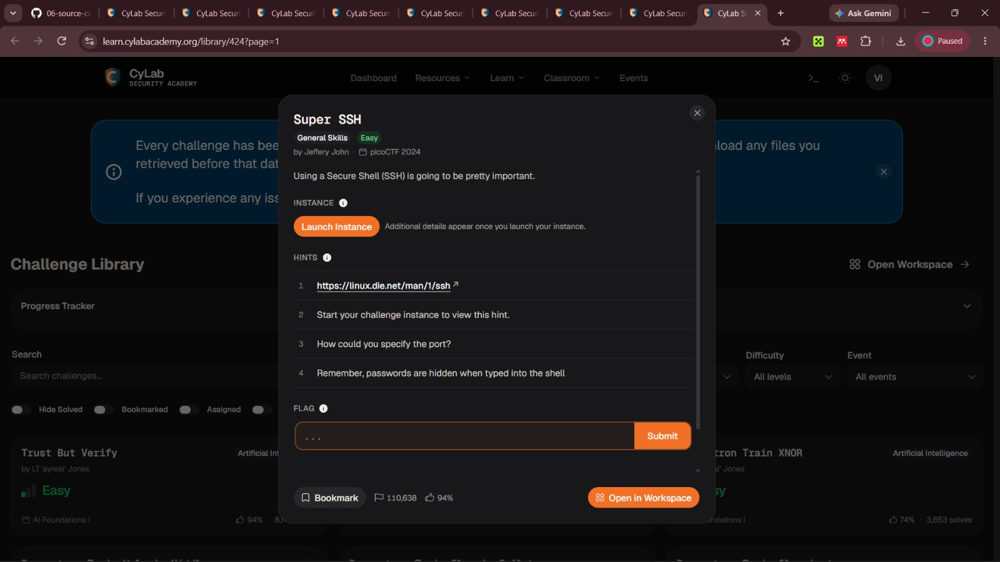

**Screenshot 2 — Command SSH dan Proses Login**

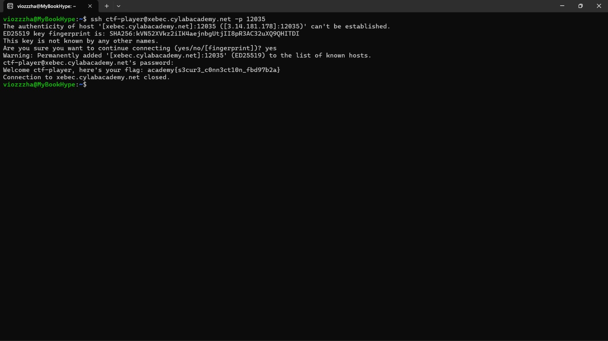

**Screenshot 3 — Hasil**

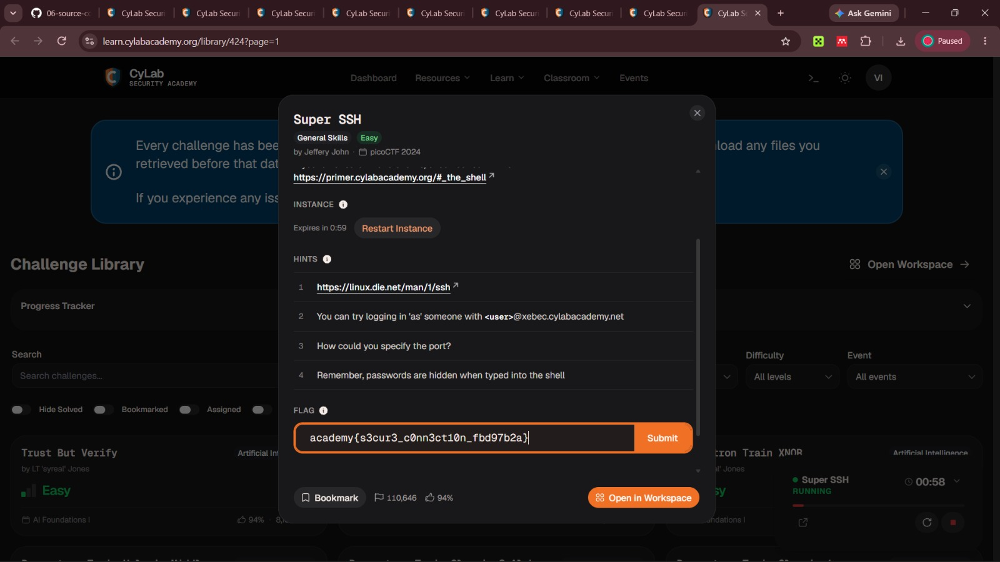

**Screenshot 4 — Submission / Correct**

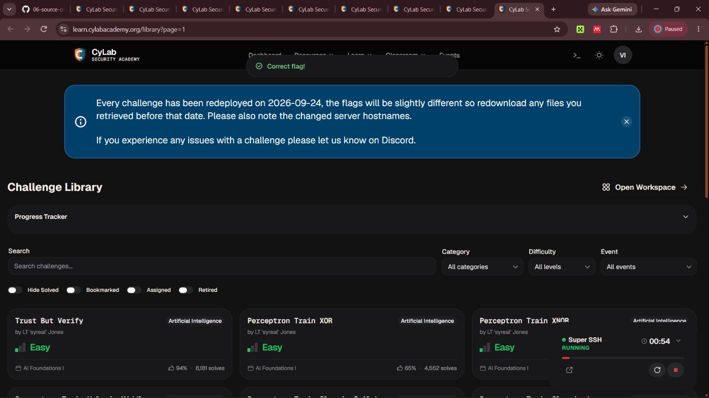

---

# 8. Piece by Piece

## Informasi Challenge

- **Nama:** Piece by Piece
- **Kategori:** General Skills
- **Protocol:** SSH
- **Username:** `ctf-player`
- **Host:** `xebec.cylabacademy.net`
- **Port:** 14750
- **Tools:** SSH, `ls`, `cat`, `unzip`

## Analisis

Pada challenge **Piece by Piece**, file yang diperlukan untuk mendapatkan flag tidak diberikan sebagai satu file utuh. File tersebut dibagi menjadi beberapa bagian atau potongan.

Saya perlu mengidentifikasi semua bagian file, menggabungkannya kembali sesuai urutan, kemudian mengekstrak file hasil gabungan untuk mendapatkan `flag.txt`.

Challenge ini memberikan latihan mengenai penggunaan command Linux untuk melihat file, membaca instruksi, menggabungkan file, dan melakukan ekstraksi ZIP.

## Proses Penyelesaian

### 1. Melakukan koneksi SSH

Pertama saya terhubung ke server menggunakan:

```bash
ssh ctf-player@xebec.cylabacademy.net -p 14750
```

### 2. Melihat isi direktori

Setelah berhasil login, saya menggunakan:

```bash
ls -la
```

Command tersebut digunakan untuk melihat seluruh file yang tersedia di dalam direktori.

Dari hasil tersebut terdapat beberapa file bagian:

```text
part_aa
part_ab
part_ac
part_ad
part_ae
```

### 3. Membaca instruksi

Saya kemudian membaca file instruksi menggunakan:

```bash
cat instructions.txt
```

Dari instruksi tersebut saya mengetahui bahwa file-file `part_aa` sampai `part_ae` perlu digabungkan terlebih dahulu.

### 4. Menggabungkan file

Saya menggabungkan seluruh bagian secara berurutan menggunakan:

```bash
cat part_aa part_ab part_ac part_ad part_ae > challenge.zip
```

Command tersebut membuat sebuah file baru bernama `challenge.zip`.

File tersebut merupakan hasil penggabungan seluruh potongan file.

### 5. Mengekstrak file ZIP

Setelah file berhasil dibuat, saya melakukan ekstraksi menggunakan:

```bash
unzip -P supersecret challenge.zip
```

Password yang digunakan adalah:

```text
supersecret
```

Setelah proses ekstraksi selesai, file `flag.txt` berhasil diperoleh.

### 6. Membaca flag

Saya menggunakan:

```bash
cat flag.txt
```

Hasilnya adalah:

`academy{z1p_and_spl1t_f1l3s_4r3_fun_fb11ace9}`

Dengan demikian challenge berhasil diselesaikan.

## Command yang Digunakan

**SSH**

```bash
ssh ctf-player@xebec.cylabacademy.net -p 14750
```

**Melihat file**

```bash
ls -la
```

**Membaca instruksi**

```bash
cat instructions.txt
```

**Menggabungkan file**

```bash
cat part_aa part_ab part_ac part_ad part_ae > challenge.zip
```

**Ekstraksi ZIP**

```bash
unzip -P supersecret challenge.zip
```

**Membaca flag**

```bash
cat flag.txt
```

## 🚩 Flag

`academy{z1p_and_spl1t_f1l3s_4r3_fun_fb11ace9}`

## Dokumentasi

**Screenshot 1 — Tampilan Challenge**

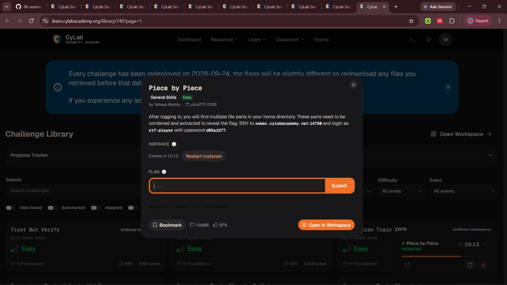

**Screenshot 2 — Koneksi dan Isi Direktori**

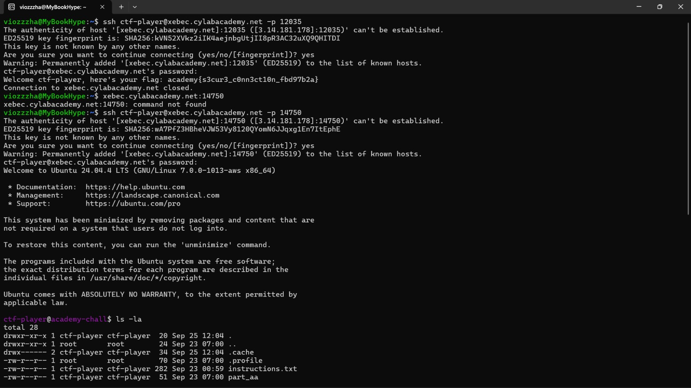

**Screenshot 3 — Menggabungkan dan Mengekstrak File**

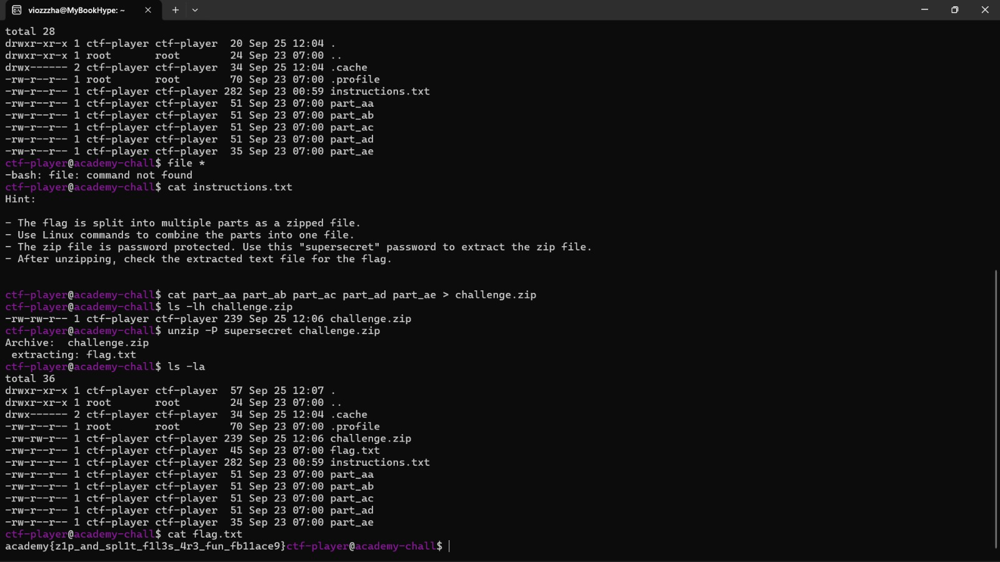

**Screenshot 4 — Hasil**

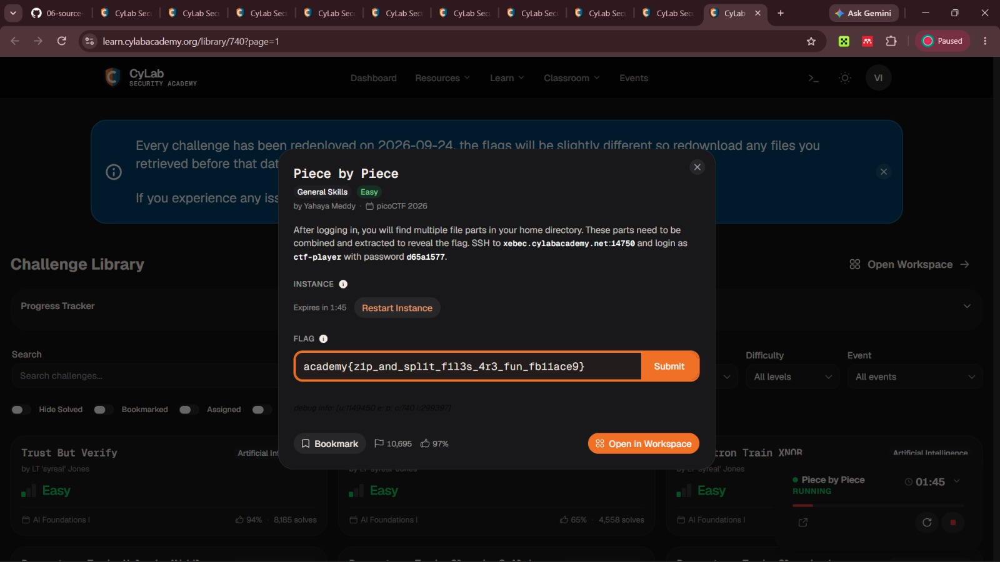

**Screenshot 5 — Submission / Correct**


---

# Rekapitulasi Hasil

| No. | Challenge | Kategori | Status |
|---|---|---|---|
| 1 | Strings It | General Skills | ✅ Solved |
| 2 | Log Hunt | General Skills | ✅ Solved |
| 3 | Running Binary | General Skills | ✅ Solved |
| 4 | Binhexa | General Skills | ✅ Solved |
| 5 | Multi Code | General Skills | ✅ Solved |
| 6 | Nice Netcat | General Skills | ✅ Solved |
| 7 | Super SSH | General Skills | ✅ Solved |
| 8 | Piece by Piece | General Skills | ✅ Solved |

**Total challenge yang diselesaikan: 8 challenge**

---

# 🚩 Daftar Flag

| No. | Challenge | Flag |
|---|---|---|
| 1 | Strings It | `academy{5tRIng5_1T_DAEbE8bd}` |
| 2 | Log Hunt | `picoCTF{us3_y0urlinux_sk1lls_cedfa5fb}` |
| 3 | Running Binary | `picoCTF{b1scu1ts_4nd_gr4vy_ac5832c}` |
| 4 | Binhexa | `academy{b1tw^3se_0p3eR@tI0n_su33essFuL_31a516a2}` |
| 5 | Multi Code | `picoCTF{nested_enc0ding_8dd03efe}` |
| 6 | Nice Netcat | `academy{g00d_k1tty_l1nc3_k1tty!_6d1e6}` |
| 7 | Super SSH | `academy{s3cur3_c0nn3ct10n_fbd97b2a}` |
| 8 | Piece by Piece | `academy{z1p_and_spl1t_f1l3s_4r3_fun_fb11ace9}` |

---

# Hal yang Dipelajari

Dari pengerjaan Week 1 ini, saya mendapatkan beberapa pemahaman baru mengenai penggunaan command Linux dan teknik dasar yang sering digunakan dalam Cyber Security.

## 1. Mencari Informasi dari File

Command seperti `strings`, `grep`, `head`, dan `cat` dapat digunakan untuk mencari dan membaca informasi tertentu dari file tanpa harus membuka seluruh isi file secara manual.

## 2. Permission pada Linux

Pada challenge Running Binary, saya belajar bahwa sebuah file harus memiliki permission execute agar dapat dijalankan sebagai program.

Command yang digunakan adalah:

```bash
chmod +x nama_file
```

## 3. Binary dan Hexadecimal

Challenge Binhexa memberikan latihan mengenai operasi pada bilangan biner dan hexadecimal, termasuk operasi bitwise seperti AND, OR, dan shift.

## 4. Encoding dan Decoding

Challenge Multi Code menunjukkan bahwa sebuah data dapat melalui beberapa lapisan encoding. Untuk menemukan informasi aslinya, setiap lapisan harus diproses secara berurutan.

## 5. Network Communication

Melalui Nice Netcat, saya belajar menggunakan Netcat untuk berkomunikasi dengan server dan memproses data yang diberikan oleh server.

## 6. SSH

Challenge Super SSH dan Piece by Piece memberikan pengalaman menggunakan SSH untuk mengakses environment challenge secara remote.

## 7. File Manipulation

Pada Piece by Piece, saya belajar bahwa beberapa bagian file dapat digabungkan kembali menggunakan command `cat`, kemudian hasilnya dapat diproses atau diekstrak menggunakan tool yang sesuai.

---

# Kesimpulan

Week 1 memberikan latihan dasar yang cukup beragam dalam kategori General Skills. Setiap challenge memiliki pendekatan yang berbeda sehingga saya tidak hanya menggunakan satu command atau satu teknik untuk semua challenge.

Dari challenge yang dikerjakan, saya belajar untuk membaca informasi dari file, mencari pola tertentu menggunakan command Linux, memahami permission file, melakukan operasi binary dan hexadecimal, melakukan decoding, serta menggunakan protokol jaringan seperti SSH dan Netcat.

Saya juga belajar bahwa dalam menyelesaikan challenge CTF, proses analisis sebelum menjalankan command sangat penting. Dengan memahami informasi yang diberikan oleh challenge, saya dapat menentukan tools dan langkah yang sesuai untuk mendapatkan flag.

Secara keseluruhan, pengerjaan Week 1 membantu saya lebih terbiasa menggunakan terminal Linux dan memahami beberapa teknik dasar yang dapat digunakan dalam proses pemecahan challenge Cyber Security.
